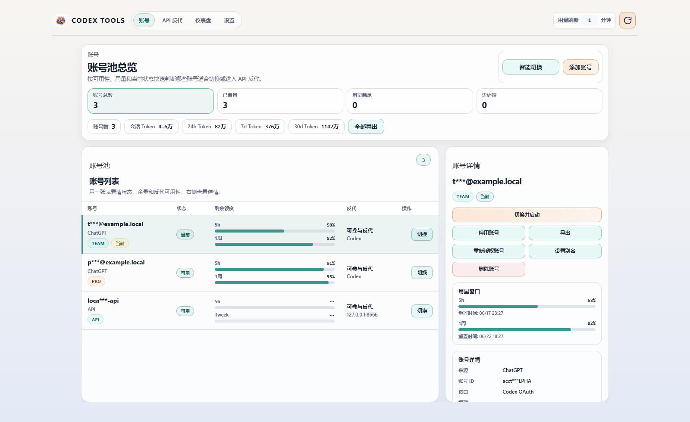

<p align="center">
  
</p>

<h1 align="center">Codex Tools</h1>

<p align="center">
  <strong>Codex / ChatGPT 多账号管理、用量监控和 OpenAI-compatible API 反代桌面控制台。</strong><br/>
  <sub>把本机 Codex 登录态整理成可观测、可切换、可公网暴露的 `/v1` 账号池，给 Codex、Cursor、CC Switch、ChatWise 和本地脚本使用。</sub>
</p>

<p align="center">
  <a href="how%20to%20use.md">快速使用</a> •
  <a href="docs/api-proxy.md">API 反代</a> •
  <a href="docs/linux-proxyd.md">Linux Proxyd</a> •
  <a href="changelog.md">更新日志</a> •
  <a href="https://github.com/mingisrookie/codex-tools/releases/latest">下载</a>
</p>

<p align="center">
  <a href="https://github.com/mingisrookie/codex-tools/releases/latest"></a>
  <a href="https://github.com/mingisrookie/codex-tools/releases"></a>
  <a href="LICENSE"></a>
  <a href="https://github.com/170-carry/codex-tools/stargazers"></a>
  <a href="https://github.com/mingisrookie/codex-tools/issues"></a>
  <a href="https://github.com/mingisrookie/codex-tools/pulls"></a>
  <a href="docs/api-proxy.md"></a>
  <a href="https://deepwiki.com/mingisrookie/codex-tools"></a>
  <a href="https://chatgpt.com/?q=Explain+the+project+mingisrookie%2Fcodex-tools+on+GitHub"></a>
</p>

<p align="center">
  
  
  
  
  
</p>

## 项目状态

| 项目 | 当前事实 |
| --- | --- |
| 当前版本 | `v2.0.6` |
| 维护发布页 | <https://github.com/mingisrookie/codex-tools/releases> |
| 上游仓库 | <https://github.com/170-carry/codex-tools> |
| 分发方式 | GitHub Release；未发布到 npm，npm 上的 `codex-tools` 不是本项目 |
| Release notes | 以 [changelog.md](changelog.md) 对应版本段为准 |

## 为什么用 Codex Tools?

| 场景 | Codex Tools 提供什么 |
| --- | --- |
| 多账号切换 | OAuth / 本机 auth 导入、批量导入导出、重授权、重命名、启停用、智能切换 |
| 用量与健康状态 | 5h、1week、credits、主动重置卡到期时间、Codex session token 统计，支持按分钟自动刷新 |
| 本地 API 反代 | 把 Codex 登录态账号池暴露为 OpenAI-compatible `/v1`，支持聊天、Responses、图片和 WebSocket |
| 可观测诊断 | Dashboard、recent requests / failures、in-flight、延迟、token、脱敏路由解释和 trace |
| 公网与远程部署 | cloudflared 快速/命名隧道，以及远程 Linux proxyd 的 SSH 部署、systemd 管理和日志读取 |
| 客户端接入 | Codex、Cursor、CC Switch、ChatWise、本地脚本等 OpenAI-compatible 客户端 |

## 应用截图

> 截图使用脱敏示例数据，账号、API Key、路径和公网地址均已打码或替换为示例值。



## v2.0.6 重点能力

### 多账号管理与切换

- OAuth 导入 Codex / ChatGPT 登录态账号，也支持批量导入、导出、重授权、重命名、启停用和删除。
- 展示账号 5h、1week、credits、Codex session token 用量，并支持按分钟配置自动刷新。
- 在账号详情中展示可用主动重置卡数量、最近一张到期时间，并可展开查看全部可用重置卡到期时间。
- 一键切换本机 Codex 账号，可选启动 Codex、同步 Opencode、重启选定编辑器。
- 智能切换会按账号健康状态、用量余量和反代可用性选择更合适的账号。

### 本地 `/v1` API 反代

- 提供 OpenAI-compatible 接口：`/v1/models`、`/v1/chat/completions`、`/v1/responses`、`/v1/images/generations`、`/v1/images/edits`、`/v1/images/variations`。
- 使用已登录 Codex 账号作为上游能力来源，支持 `gpt-5.4`、`gpt-5.5`、`gpt-image-2` 等模型链路。
- `/v1/models` 优先原样透出 Codex upstream catalog，静态 fallback 补充 `gpt-5.3-codex-spark` / `codex-auto-review`。
- 兼容旧客户端请求 `gpt-5-mini`，内部映射到上游支持的 `gpt-5.4-mini`，但模型列表不再展示旧别名。
- 支持指定 `ChatGPT-Account-Id` 固定账号；未指定时按用量、认证状态、cooldown、顺序/平均负载策略选择账号。
- 默认启用 runtime-only session affinity，同一会话优先粘同一账号，但不会绕过认证、用量或 cooldown 可用性检查。
- 对 Fast / Priority 档位做兼容映射；下游传 `service_tier: fast` 时映射为上游 `priority`。

### Dashboard、诊断与安全

- Dashboard 展示请求量、失败率、延迟分位、token、in-flight 请求、recent requests 和 recent failures。
- trace / metrics 增加账号路由解释：候选数、选中账号脱敏标签、账号 ID hash、affinity、cooldown、latency 参与情况。
- 账号、session key、邮箱、API key 等敏感字段默认脱敏，不把完整身份信息写进公开截图或文档。
- 单账号或全部候选 cooldown 时不会再把候选池清空成误报 503；cooldown 只在仍有其他可用候选时用于失败降权。
- access token 过期不直接阻塞 keepalive；只有 refresh token 失效、账号停用或确需登录时才提示重授权。

### 公网访问与远程 proxyd

- 可通过内置 cloudflared 快速隧道或命名隧道把本地反代暴露到公网。
- 支持远程 Linux proxyd 部署，把代理服务放到服务器上运行，并可在桌面端通过 SSH 部署、安装 systemd、启动/停止、查看状态和读取日志。
- 支持 CC Switch、Cursor、ChatWise、本地脚本或其他 OpenAI-compatible 客户端接入。

## 快速使用

### 1. 下载应用

从当前维护发布页下载最新版本：

<https://github.com/mingisrookie/codex-tools/releases/latest>

如果 macOS 提示应用已损坏，可参考：

```bash
sudo spctl --master-disable
sudo xattr -r -d com.apple.quarantine /Applications/Codex\ Tools.app
```

### 2. 导入账号

1. 打开 Codex Tools。
2. 在“账号”页点击“添加账号”。
3. 选择 OAuth 登录、导入当前本机 Codex 登录态，或批量导入已有 auth JSON。
4. 导入后刷新用量，确认账号状态为可用。

### 3. 启动本地 API 反代

1. 进入“API 反代”页。
2. 配置端口和本地 API Key。
3. 点击启动后，客户端使用：

```text
Base URL: http://127.0.0.1:<port>/v1
API Key: 应用内显示的本地 proxy key
```

默认端口可在应用内调整；本机常见配置是 `8787` 或自定义端口。

## 客户端接入提示

### 本机客户端

本机脚本、ChatWise、CC Switch 等客户端可以直接使用本地地址，例如：

```text
http://127.0.0.1:8787/v1
```

### Cursor

Cursor 不建议填写 `127.0.0.1`、`localhost`、`192.168.x.x`、`10.x.x.x` 这类本地或私网地址。如果看到 `ssrf_blocked` 或 `connection to private IP is blocked`，通常是 Cursor 侧拦截私网地址，不是 Codex Tools 代理本身报错。

给 Cursor 使用时建议选择：

- 应用内 cloudflared 生成的公网 `Public URL`。
- 远程 Linux proxyd 暴露的公网服务器地址。
- 自己的公网域名反向代理到本地或远程反代。

## 文档入口

| 文档 | 适合什么时候看 |
| --- | --- |
| [how to use.md](how%20to%20use.md) | 第一次使用、导入账号、刷新用量、切换账号和开启本地反代 |
| [docs/api-proxy.md](docs/api-proxy.md) | 接入 `/v1`、排查模型/账号/请求转换/SSE/Dashboard 问题 |
| [docs/linux-proxyd.md](docs/linux-proxyd.md) | 把代理部署到远程 Linux 服务器、systemd 管理和日志读取 |
| [项目完整链路说明.md](项目完整链路说明.md) | 继续开发前理解 UI、Tauri、Rust service、store 和 proxy 的完整链路 |
| [项目开发规范（AI协作）.md](项目开发规范（AI协作）.md) | 做代码/文档/发布改动前确认架构边界、检查项和文档同步规则 |

## 支持范围与边界

- 这是 **Codex / ChatGPT 登录态账号池代理**，不是完整 OpenAI 官方 API 网关。
- 对外支持 OpenAI-compatible `/v1/models`、`/v1/chat/completions`、`/v1/responses` 和图片接口；其他 `/v1/*` 路径会按未支持处理。
- 图片生成/编辑能力取决于账号是否具备上游 `image_generation` 工具权限。
- Cursor 等服务端代发请求的客户端通常不能直连 `127.0.0.1`，建议使用 cloudflared 或远程 Linux proxyd。
- 公开截图、文档和日志不要泄露真实邮箱、账号 ID、API Key、session key、私钥或公网地址。

## 本地开发

### 环境要求

- Node.js 20+
- Rust stable
- Windows 或 macOS

### 安装依赖

```bash
npm install
```

### 启动前端开发服务

```bash
npm run dev
```

### 启动桌面应用

```bash
npm run tauri dev
```

### 常用检查

```bash
npm run lint
npm run build
cargo test --manifest-path src-tauri/Cargo.toml
cargo test --manifest-path src-tauri/proxyd/Cargo.toml
```

## 打包与发布

版本发布需要同步更新：

- `package.json`
- `src-tauri/Cargo.toml`
- `src-tauri/proxyd/Cargo.toml`
- `src-tauri/tauri.conf.json`
- `changelog.md`
- 必要时同步 `README.md` 和截图

当前 `fork` 的 `v2.0.6` Release 已发布，Release notes 以 `changelog.md` 中对应版本段为准。现有 `.github/workflows/release.yml` 仍使用静态 release body；“自动从 `changelog.md` 抽取版本段”的 workflow patch 需要带 `workflow` scope 的 GitHub token 后再启用，不能在未成功推送前当成已生效能力。

发布 tag 示例：

```bash
git tag v2.0.6
git push fork v2.0.6
```

本地无签名构建可使用：

```bash
npm run tauri -- build --no-bundle
```

详细 API 反代链路见 [docs/api-proxy.md](docs/api-proxy.md)，远程 Linux proxyd 见 [docs/linux-proxyd.md](docs/linux-proxyd.md)。

## 目录说明

- `src/`：React 前端、组件、状态 hook、i18n、样式。
- `src-tauri/`：Tauri 2 桌面后端、账号/认证/设置/API 反代/cloudflared/远程 proxyd。
- `src-tauri/proxyd/`：独立 Linux proxyd crate。
- `docs/`：API 反代、远程 proxyd 等长期文档。
- `.github/workflows/release.yml`：GitHub Actions 发布流程；当前 release body 仍为静态模板，自动抽取 changelog 需后续带 workflow 权限推送。

## Star History

<a href="https://www.star-history.com/?repos=170-carry/codex-tools&type=date&legend=top-left">
 <picture>
   <source media="(prefers-color-scheme: dark)" srcset="https://api.star-history.com/image?repos=170-carry/codex-tools&type=date&theme=dark&legend=top-left" />
   <source media="(prefers-color-scheme: light)" srcset="https://api.star-history.com/image?repos=170-carry/codex-tools&type=date&legend=top-left" />
   
 </picture>
</a>

## License

MIT，详见 [LICENSE](LICENSE)。
