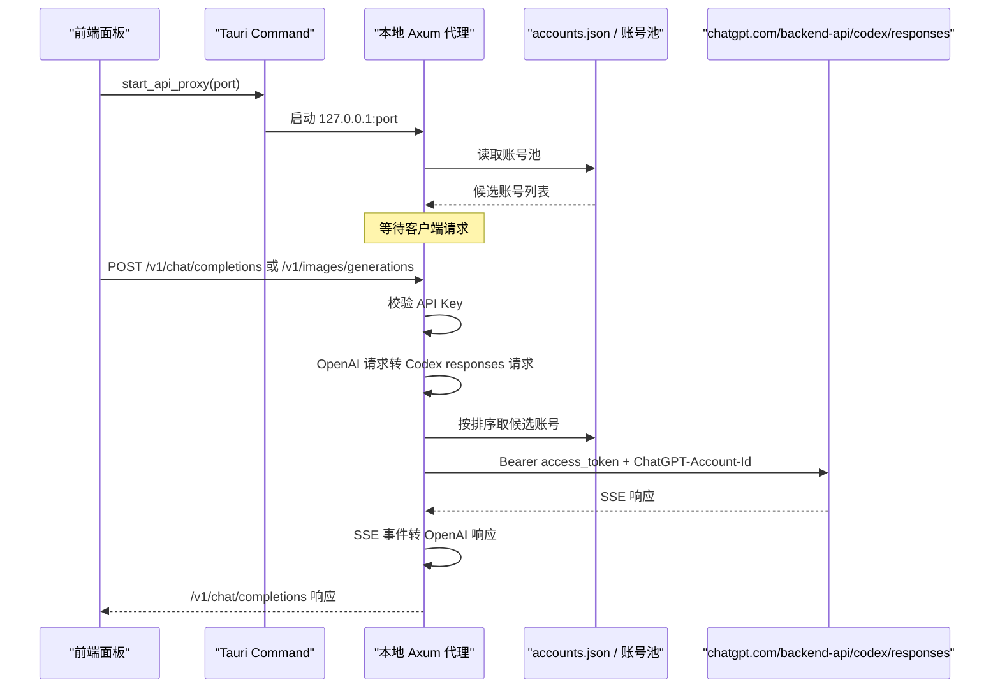

# API 反代链路说明

本文说明当前项目中的 API 反代实现。目标是让你从入口到上游返回，完整看懂这条链路现在是怎么工作的。

当前版本已经只保留一种反代方式：

- 本地对外暴露 OpenAI 兼容接口
- 上游统一转到 Codex 的 `chatgpt.com/backend-api/codex/responses`
- 不再保留旧的多模式反代
- Axum 请求体大小上限默认放宽到 `512 MiB`

实现参考了 `CLIProxyAPIPlus` 的 Codex executor 思路，但不是把它整仓搬进来，而是把核心方法收敛到本项目现有架构里。

## 1. 当前反代的定位

### 本地入口

- `GET /health`
- `GET /v1/models`
- `POST /v1/chat/completions`
- `POST /v1/responses`
- `POST /v1/images/generations`
- `POST /v1/images/edits`
- `POST /v1/images/variations`

### 上游入口

- `POST https://chatgpt.com/backend-api/codex/responses`

也就是说：

- 客户端以为自己在调用 OpenAI 风格的 `/v1/*`
- 实际上本地代理会把请求转换为 Codex `responses` 协议
- 然后用账号池中的 ChatGPT/Codex 登录态去访问上游

## 2. 为什么这样设计

之前的问题有两个：

- 直接打 `api.openai.com/v1/*` 时，很多导入的账号本质上只有 ChatGPT/Codex 登录态，不一定有公共 OpenAI API scope 或 quota
- 旧的 `conversation` 直通方式过于贴近历史接口，不适合作为稳定代理基座

现在的方案本质上是：

- 下游维持 `/v1` 兼容，方便接各种现成客户端
- 上游切到 Codex 当前更合适的 `responses` 入口
- 中间由本地代理负责协议转换

## 3. 整体时序



## 4. 入口与生命周期

### 4.1 前端触发

前端入口在：

- `src/components/ApiProxyPanel.tsx`
- `src/components/DashboardPanel.tsx`
- `src/hooks/useCodexController.ts`

用户在面板点击“启动 API 反代”后：

1. 前端读取端口输入框
2. 调用 Tauri 命令 `start_api_proxy`
3. 成功后显示：
   - `Base URL`
   - `API Key`
   - 当前命中的账号
   - 最近错误

### 4.2 Tauri 命令

Tauri 命令入口在：

- `src-tauri/src/lib.rs`

相关命令：

- `get_api_proxy_status`
- `start_api_proxy`
- `stop_api_proxy`

### 4.3 后端运行态

后端运行态在：

- `src-tauri/src/state.rs`

这里维护：

- 监听端口
- 当前代理 API Key
- 运行任务句柄
- 当前命中的账号 ID/标签
- 最近一次错误

## 5. 启动时到底做了什么

启动逻辑在：

- `src-tauri/src/proxy_service.rs`

`start_api_proxy_internal(...)` 做的事情是：

1. 检查当前是否已经有代理在运行
2. 从账号池加载可用账号
3. 绑定本地端口，默认 `8787`
4. 生成一个本地代理专用 `sk-...` API Key
5. 解析 Codex CLI 客户端身份并创建 `reqwest::Client`
   - 优先使用 `CODEX_TOOLS_CODEX_CLIENT_VERSION`
   - 其次读取本机 `codex --version` / `codex.cmd --version`
   - 再读取全局 npm 包 `@openai/codex/package.json`
   - 最后回退到内置默认版本
6. 启动一个 `axum` HTTP 服务
7. 注册以下路由：
   - `/health`
   - `/v1/models`
   - `/v1/chat/completions`
   - `/v1/responses`
   - `/v1/images/generations`
   - `/v1/images/edits`
   - `/v1/images/variations`
   - 对请求体启用 `512 MiB` 默认上限，可用 `CODEX_TOOLS_PROXY_MAX_BODY_MIB` 覆盖
8. 把运行状态写入全局 `AppState`

## 6. 本地暴露的接口

### 6.1 `GET /health`

用途：

- 用于判断本地代理服务是否活着

返回：

```json
{ "ok": true }
```

### 6.2 `GET /v1/models`

用途：

- 给兼容客户端一个模型列表

特点：

- 有可用账号时，优先读取 Codex upstream 的 `/backend-api/codex/models?client_version=...`
- 返回里的 `models` 字段保留上游 Codex catalog 原样，避免把本地兼容别名暴露成“可选模型”
- 返回里的 `data` 字段转换成 OpenAI-compatible model list，并追加本地图片接口支持的 `gpt-image-*` / `chatgpt-image-latest`
- 如果账号不可用、catalog 读取失败或上游返回异常，才回退到本地静态 fallback
- `gpt-5-mini` 不再作为可选模型展示；旧客户端请求里的 `gpt-5-mini` 会在转发前兼容映射到 `gpt-5.4-mini`
- `gpt-5.3-codex-spark` 会随上游 catalog 暴露；静态 fallback 也包含该模型
- `gpt-5.4-mini` 不标记 Fast / Priority 服务档位，除非未来上游 catalog 明确声明

### 6.3 `POST /v1/chat/completions`

用途：

- 兼容绝大多数 OpenAI Chat Completions 客户端

行为：

- 本地接收 OpenAI 风格请求
- 转为 Codex `responses` 请求
- 上游始终按 SSE 模式请求
- 如果下游请求 `stream: true`，本地再把上游 SSE 转成 OpenAI ChatCompletions SSE
- 如果下游请求 `stream: false`，本地边读上游 SSE 边解码；一旦收到 `response.completed` / `response.done` 终止事件并拿到完整 `response`，立即拼成普通 JSON 返回，不等待上游连接自然 EOF

### 6.4 `POST /v1/responses`

用途：

- 给直接走 OpenAI Responses 风格的客户端使用

行为：

- 请求体不做大的协议改写，只做必要归一化
- 上游仍然统一发到 Codex `responses`
- `stream: true` 时近似透传 SSE
- `stream: false` 时同样边读 SSE 边提取终止事件，拿到 `response.completed` / `response.done` 后立即返回标准 JSON，不等待完整连接关闭

### 6.5 `POST /v1/images/*`

用途：

- 给 OpenAI Images API 兼容客户端使用，当前主目标是通过本地代理调用 Codex 账号的 `gpt-image-2` 图片能力。

支持路径：

- `/v1/images/generations`
- `/v1/images/edits`
- `/v1/images/variations`

行为：

- 下游仍使用 OpenAI 风格图片请求。
- 本地转换为 Codex `responses` 请求，并注入 `image_generation` 工具。
- `model` 默认使用 `gpt-image-2`，同时保留 `gpt-image-1.5`、`gpt-image-1`、`gpt-image-1-mini` 和 `chatgpt-image-latest` 兼容。
- 非流式响应会从 Codex `image_generation_call.result` 中提取图片 base64，返回 OpenAI 风格的 `data[].b64_json`。
- 流式响应会把上游图片事件转换为 Images API 可消费的 SSE chunk。
- 图片请求仍必须使用本工具面板里的本地代理 API Key，不应直连 `api.openai.com`。

## 7. 鉴权方式

本地代理有自己的一层鉴权，不直接暴露给任意本地程序。

支持两种传法：

- `X-API-Key: sk-...`
- `Authorization: Bearer sk-...`

校验逻辑：

- 只认启动代理时生成的那一个本地 `API Key`
- 这层 key 只是本地代理的门锁
- 它不是上游 OpenAI API Key
- 它也不是账号池里真实的 `access_token`

## 8. 账号池是怎么参与反代的

账号来源：

- 应用数据目录下的 `accounts.json`（例如 macOS `~/Library/Application Support/com.carry.codex-tools/accounts.json`，Windows `%APPDATA%\com.carry.codex-tools\accounts.json`）

数据结构定义在：

- `src-tauri/src/models.rs`

每个账号核心字段有：

- `label`
- `account_id`
- `auth_json`
- `usage`
- `plan_type`

代理真正需要的认证信息来自 `extract_auth(...)`：

- `access_token`
- `account_id`
- 可选 `plan_type`

## 9. 账号排序与挑选规则

候选账号在每次请求时重新读取，并重新排序，不做固定缓存。

排序规则：

1. 跳过已停用账号，阻塞或健康异常账号靠后
2. `plus` / `team` / `pro` 等非 `free` 计划优先，`free` 作为兜底
3. 同类账号按 `1week`、`5h` 已用百分比从低到高排序
4. 最后按标签名和账号 key 保持稳定排序
5. 平均负载模式会在同健康、同计划优先级、同粗用量 bucket（默认按 50% 使用率分桶）的账号内，从上一次命中账号的下一个账号开始轮转；当 bucket 内账号都有最近延迟 EWMA 样本且差异足够明显时，同级 bucket 内才优先选择低延迟账号，避免单账号抖动把短请求 p50/avg 拉高，也避免未采样账号长期饿死。
6. 顺序负载均衡模式会在上述排序基础上优先复用当前同级账号，直到它达到配置的 `5h` 使用阈值；不会让当前 `free` 账号压过可用的非 `free` 账号

也就是：

- 已停用账号不会参与反代，阻塞账号不会抢在正常账号前面
- 非 `free` 计划优先，`free` 计划只在非 `free` 不可用或耗尽时兜底
- 在同一类候选中，优先挑健康且更有余量的账号
- 平均模式用于低延迟与多账号摊平，排序后会在同计划、同粗用量 bucket 内轮转起点；只有 bucket 内候选都有最近延迟样本且 EWMA 差距足够明显时，才把更快账号排到前面，否则保持轮转顺序
- 顺序负载均衡避免长期压到同一个账号，但不会删除基础健康/计划/余量排序，也不会跨计划等级粘住低优先级账号
- 账号用量自动刷新默认每 1 分钟一轮，可在账号界面按分钟调整；手动刷新按钮仍会立即请求

### 9.1 Session affinity

代理默认启用 runtime-only session affinity，用来让同一客户端会话优先命中同一账号，减少多轮工具/上下文请求在不同账号之间漂移。

会话 key 来源：

- 下游显式 header：`Session_id`、`x-session-id`、`x-codex-session-id`
- Responses payload 字段：`session_id`、`sessionId`、`previous_response_id`、`conversation_id`、`user`

关键边界：

- 只保存短 hash，不保存原始 session/user 值。
- 映射只存在于当前代理运行态，不写入 `accounts.json` 或设置。
- 有容量上限和过期淘汰，避免长期增长。
- affinity 在认证、用量、runtime cooldown 过滤之后才重排候选，所以不会绕过账号禁用、授权失败、用量耗尽或 cooldown。
- 无 session key、无绑定、绑定账号当前不可用时，立即回退到原有平均/逐个负载策略和 EWMA 延迟优先逻辑。

对应逻辑：

- `load_proxy_candidates(...)`
- `compare_proxy_candidates(...)`
- `proxy_session_affinity_key(...)`
- `apply_session_affinity(...)`

## 10. 请求发到上游时带了什么

真正向上游发请求时，目标是：

- `https://chatgpt.com/backend-api/codex/responses`

关键请求头：

- `Authorization: Bearer <candidate.access_token>`
- `ChatGPT-Account-Id: <candidate.account_id>`
- `Originator: codex_cli_rs`
- `Version: <当前解析到的 Codex CLI 版本>`
- `Session_id: <uuid>`
- `User-Agent: codex_cli_rs/<当前解析到的 Codex CLI 版本>`
- `Accept: text/event-stream`
- `Content-Type: application/json`

这里有几个关键点：

- 不是发到 `api.openai.com/v1/*`
- 不是发到旧的 `conversation`
- 默认跟随本机官方 Codex CLI 的版本头；远程或无 CLI 环境可用 `CODEX_TOOLS_CODEX_CLIENT_VERSION` 显式指定
- 上游固定按 SSE 返回

## 11. `chat/completions` 到 Codex `responses` 的转换

这是当前链路最核心的一层。

### 11.1 默认注入字段

本地会补这些字段：

- `stream: true`
- `store: false`
- `instructions: ""`
- `parallel_tool_calls: true`

普通 `/v1/chat/completions` 不会默认注入 `reasoning` 和 `include:["reasoning.encrypted_content"]`，避免短请求被强制走 reasoning summary 路径拖慢。只有下游显式传入 `reasoning_effort` 或 `reasoning` 时，才补齐：

- `reasoning.effort`（缺失时默认 `medium`）
- `reasoning.summary`（缺失时默认 `auto`）
- `include: ["reasoning.encrypted_content"]`

这里 `store: false` 很关键。

实际验证里，上游 `backend-api/codex/responses` 明确要求：

- 没带 `store: false` 会报错

### 11.2 message 角色映射

OpenAI 风格消息会被转换为 Codex `input` 数组。

角色映射：

- `system -> developer`
- `developer -> developer`
- `user -> user`
- `assistant -> assistant`
- `tool -> function_call_output`

### 11.3 content 映射

文本：

- `text -> input_text` 或 `output_text`

图片：

- `image_url -> input_image`

文件：

- `file -> input_file`

### 11.4 tool 调用映射

OpenAI 里的：

- `assistant.tool_calls`
- `tool` 消息

会被拆成 Codex 里的：

- `function_call`
- `function_call_output`

### 11.5 结构化输出映射

如果下游传了：

- `response_format`
- `text.verbosity`

本地会转换到上游的：

- `text.format`
- `text.verbosity`

## 12. `/v1/responses` 的归一化

如果下游直接请求 `/v1/responses`，本地不会像 `chat/completions` 那样大幅转换，只做必要补丁：

- 强制 `stream: true`
- 强制 `store: false`
- 模型名先做请求侧兼容映射：`gpt-5-mini` 会转成上游支持的 `gpt-5.4-mini`；响应侧不会再把上游模型名改回兼容别名
- 对支持 Fast / Priority 服务档位的模型，如果下游没有传 `service_tier`，默认补 `service_tier: priority`；如果下游传 `service_tier: fast`，同样映射为上游的 `priority`
- 兼容 OpenAI Responses 常见写法：`input` 为字符串时会转换为用户文本消息列表；下游传入的 `max_output_tokens` 会被剥离，避免 Codex upstream 拒绝该字段
- 缺失时补 `instructions`
- 缺失时补 `parallel_tool_calls`
- 默认不新增 `reasoning`；只有请求已带 `reasoning` 时，才补齐 `reasoning.effort = medium`、`reasoning.summary = auto`，并确保 `include` 里有 `reasoning.encrypted_content`
- 丢弃上游不接受的 `metadata` 字段，避免 Cursor 等客户端报 `Unsupported parameter: metadata`

## 13. 上游 SSE 是怎么转回 OpenAI 的

### 13.1 `POST /v1/responses`

如果下游本来就是 Responses 客户端：

- `stream: true` 时，基本按 SSE 透回去
- `stream: false` 时，从上游 SSE 流中即时提取 `response.completed` / `response.done`，遇到终止事件后直接返回，不等 EOF

### 13.2 `POST /v1/chat/completions`

这是转换最多的地方。

上游返回的是 Codex SSE 事件流，本地会把关键事件转成 OpenAI ChatCompletions SSE。

#### 事件映射

| 上游事件 | 本地输出 |
| --- | --- |
| `response.created` | 初始化状态，不立即输出 |
| `response.reasoning_summary_text.delta` | `delta.reasoning_content` |
| `response.reasoning_summary_text.done` | 补一个换行分隔 |
| `response.output_text.delta` | `delta.content` |
| `response.output_item.added` with `function_call` | `delta.tool_calls` 开始事件 |
| `response.function_call_arguments.delta` | `delta.tool_calls[].function.arguments` 增量 |
| `response.function_call_arguments.done` | 参数结束兜底 |
| `response.output_item.done` with `function_call` | 工具调用完成兜底 |
| `response.completed` | `finish_reason` + `[DONE]` |

#### 非流式时怎么处理

如果下游 `stream: false`：

1. 本地仍然向上游请求 SSE
2. 边读边用 SSE decoder 解析事件
3. 一遇到 `response.completed` / `response.done` 并拿到完整 `response` 就停止继续等待上游 EOF
4. 从 `response.output` 里提取：
   - assistant 文本
   - reasoning summary
   - tool calls
   - usage
5. 拼成一个普通的 OpenAI ChatCompletions JSON；如果先遇到 `response.failed` / `response.incomplete` / `response.cancelled`，按上游终止错误返回

`/v1/chat/completions` 与 `/v1/responses` 的流式和非流式请求都会写入 dashboard metrics / `api-proxy-trace.log`，关键阶段包括 `first_upstream_chunk`、`sse_terminal_event`、`non_stream_response_ready` 或流式结束事件。非流式总耗时以终止事件命中为准，不再把上游长连接后续 EOF 等待计入正常响应路径。trace、dashboard metrics 和 usage token 统计写入都在后台执行，不阻塞客户端响应返回。

Dashboard 的“最近请求”和“最近失败”会展示 status、`error_kind`、`failure_category`、完整 `failure_brief` 和 `route_explanation`。其中 route explanation 包含负载策略、候选总数/可用候选数、选中账号脱敏标签与账号 ID hash 摘要、认证/用量/cooldown 排除计数、指定账号 header 是否命中、session affinity 是否命中、EWMA latency 是否参与。Dashboard 前端还支持按来源 endpoint、模型和脱敏账号筛选最近请求/失败；trace 文本只保留脱敏标签、hash 摘要和错误短摘要，便于 tail 日志快速扫；前端日志卡片优先使用 metrics 中的完整错误正文，方便确认错误是否已经透传到用户侧。

## 14. 失败重试与自动切号

每次请求会按候选账号顺序尝试。

对单个账号的流程：

1. 先用当前 token 发上游请求
2. 如果命中“疑似 token 过期/失效”信号，则先 refresh
3. refresh 成功后重试这个账号一次
4. 如果仍失败，再判断是否属于可切下一个账号的错误

### 14.1 会触发 refresh 的情况

- `401`
- 错误体包含：
  - `token expired`
  - `jwt expired`
  - `invalid token`
  - `session expired`
  - `login required`

### 14.2 refresh 成功后还会做什么

刷新成功后会把新的认证状态写回两处：

- 账号池里的 `accounts.json`
- 如果它正好是当前激活账号，也会回写 `~/.codex/auth.json`

### 14.3 cooldown 与顺序账号持久化

- 候选账号 cooldown 使用失败发生时的当前时间计算，不能复用请求刚开始挑选账号时的旧时间，避免长时间等待上游响应头后冷却窗口已经落在过去
- runtime cooldown 只用于“有其他候选账号时”的失败降权；如果当前过滤会把候选池清空（例如只有一个账号，或所有剩余账号都处于短暂传输失败 cooldown），代理会保留这些账号继续真实上游尝试，避免把本地冷却误报成“全部代理账号 5 小时用量已耗尽”
- 顺序模式仍会同步更新运行时当前账号，保证面板和后续请求立即看到新目标
- `accounts.json` 中的顺序账号目标只在目标账号变化时持久化，且持久化走后台任务，避免本地文件锁或磁盘写入阻塞首字路径

### 14.4 上游响应头超时

`service_tier: priority` 的普通请求默认用较短响应头超时，避免坏账号或上游卡顿拖慢切号；但大上下文请求会按序列化后的请求体大小放宽：

- 小于 `1 MiB`：`5s`
- `1 MiB` 到 `2 MiB`：`20s`
- 大于等于 `2 MiB`：`45s`

`reasoning.effort: xhigh` 或非 priority 请求继续使用常规 `60s` 响应头超时。

## 15. 失败分类

如果某个账号失败，本地会尽量分类，而不是只报一个泛泛的 `429`。

当前分类：

- `额度用完`
- `频率限制`
- `模型受限`
- `鉴权失败`
- `权限不足`

当所有候选账号都失败时，会返回类似：

- 哪一类失败有多少个
- 再附一个示例原因

这样你能更快判断是：

- 账号整体没额度
- 当前模型不支持
- 还是登录态坏了

## 16. 最近错误和当前账号是怎么展示的

运行中的状态会保存在：

- `ApiProxyRuntimeSnapshot`

主要字段：

- `active_account_id`
- `active_account_label`
- `last_error`

前端轮询这些状态，所以面板上能看到：

- 当前命中的账号
- 最近一次错误

## 17. Cloudflared 和反代的关系

Cloudflared 不是第二套代理逻辑，它只是把当前本地代理继续暴露到公网。

关系是：

1. 本地 API 反代先启动
2. Cloudflared 再把这个本地端口转出去

所以链路是：

```text
客户端 -> cloudflared 公网地址 -> 本地 127.0.0.1:8787/v1/* -> Codex 上游
```

Cloudflared 不参与：

- 请求协议转换
- 账号挑选
- token refresh
- SSE 到 OpenAI 的映射

它只负责公网入口。

## 18. 为什么没有用 `responses/compact`

当前实现统一走：

- `backend-api/codex/responses`

没有走：

- `backend-api/codex/responses/compact`

原因是实际验证里：

- `/responses` 是当前主路径，SSE 和普通返回都能靠它做出来
- `/responses/compact` 在部分情况下兼容性不稳定
- 当前项目先追求稳定链路，不再引入第二条上游分支

## 19. 当前的边界与限制

当前版本不是“完整 OpenAI API 网关”，而是“OpenAI 兼容的 Codex 代理”。

明确限制：

- 只支持：
  - `GET /v1/models`
  - `POST /v1/chat/completions`
  - `POST /v1/responses`
  - `POST /v1/images/generations`
  - `POST /v1/images/edits`
  - `POST /v1/images/variations`
- 其他 `/v1/*` 路径目前直接返回不支持
- 模型列表动态优先：有可用账号时按 Codex upstream catalog 原样返回；读取失败才使用本地静态 fallback
- `/v1/responses` 的流式是近似透传，不额外做深层语义改写
- 图片接口依赖账号是否具备上游图片能力；如果账号不支持 `image_generation` 工具，本地会返回上游的模型/工具受限错误
- 核心目标是把最常用的聊天和图片链路稳定打通

## 20. 代码位置索引

如果你要继续看代码，优先看这些文件：

- 启动、路由、转换、账号轮换：
  - `src-tauri/src/proxy_service.rs`
- Tauri 命令：
  - `src-tauri/src/lib.rs`
- 运行态：
  - `src-tauri/src/state.rs`
- 账号结构：
  - `src-tauri/src/models.rs`
- 前端面板：
  - `src/components/ApiProxyPanel.tsx`
  - `src/components/DashboardPanel.tsx`
- 前端控制器：
  - `src/hooks/useCodexController.ts`
- 调试脚本：
  - `scripts/bench-900k-fast-xhigh-compare.ps1`
  - `scripts/probe-fast-service-tier.ps1`

## 21. 一个完整请求示例

以这个调用为例：

```bash
curl http://127.0.0.1:8787/v1/chat/completions \
  -H 'Content-Type: application/json' \
  -H 'Authorization: Bearer sk-xxxx' \
  -d '{
    "model": "gpt-5",
    "stream": false,
    "messages": [
      { "role": "user", "content": "1+1 等于几？只回答结果。" }
    ]
  }'
```

内部实际流程是：

1. 本地校验 `sk-xxxx`
2. 找到可用账号列表
3. 把请求改写成 Codex `responses` 请求
4. 强制补 `store: false`
5. 带着账号 `access_token + account_id` 去打上游
6. 上游返回 SSE
7. 本地边读 SSE 边抽取 `response.completed`，命中终止事件后立即返回
8. 转成 OpenAI ChatCompletions JSON
9. 返回类似：

```json
{
  "object": "chat.completion",
  "choices": [
    {
      "message": {
        "role": "assistant",
        "content": "2"
      },
      "finish_reason": "stop"
    }
  ]
}
```

## 22. 调试方式

### 看服务是否起来

```bash
curl http://127.0.0.1:8787/health
```

### 看模型列表

```bash
curl http://127.0.0.1:8787/v1/models \
  -H 'Authorization: Bearer 你的sk'
```

### 看聊天结果

```bash
curl http://127.0.0.1:8787/v1/chat/completions \
  -H 'Content-Type: application/json' \
  -H 'Authorization: Bearer 你的sk' \
  -d '{
    "model": "gpt-5",
    "stream": false,
    "messages": [
      { "role": "user", "content": "1+1 等于几？只回答结果。" }
    ]
  }'
```

### 保留原始响应用于排查

```bash
mkdir -p output
curl -i http://127.0.0.1:8787/v1/chat/completions \
  -H 'Content-Type: application/json' \
  -H 'Authorization: Bearer 你的sk' \
  -d '{
    "model": "gpt-5",
    "stream": false,
    "messages": [
      { "role": "user", "content": "1+1 等于几？只回答结果。" }
    ]
  }' > output/api-proxy-chat-response.txt
```

这会把响应头和响应体保存到本地文件，方便继续排查。Windows PowerShell 下如果 `curl` 被别名覆盖，使用 `curl.exe`。

### 跑现有 benchmark / service tier 探测

仓库当前没有专用 npm 调试脚本，不要引用不存在的命令。已有的专项脚本是：

```powershell
.\scripts\probe-fast-service-tier.ps1 -BaseUrl http://127.0.0.1:8787/v1 -ApiKey 你的sk
.\scripts\bench-900k-fast-xhigh-compare.ps1 -BaseUrl http://127.0.0.1:8787/v1 -ApiKey 你的sk
```

## 23. 通过 CC Switch 接入 Codex

如果你想把本工具作为“账号池 + OpenAI 兼容反代”，再由 [CC Switch](https://github.com/farion1231/cc-switch) 来统一管理 Codex provider，这条链路是支持的。

原因很简单：

- 本工具下游暴露的是 OpenAI 兼容 `/v1` 接口
- CC Switch 给 Codex 写入的自定义 provider 也是 `OPENAI_API_KEY + base_url + wire_api = "responses"` 这套配置

也就是说：

- `codex-tools -> CC Switch -> Codex`
- 协议层是能对上的

### 23.1 适用范围

当前这套接入方式，适用于：

- CC Switch 中的 **Codex 自定义 provider**

不适用于：

- 直接把这个地址当成 **Claude 原生 provider** 去直连

原因是本工具当前只提供 OpenAI 兼容出口：

- `GET /v1/models`
- `POST /v1/chat/completions`
- `POST /v1/responses`
- `POST /v1/images/generations`
- `POST /v1/images/edits`
- `POST /v1/images/variations`

并没有直接提供 Anthropic Messages 协议。

### 23.2 推荐配置

在 CC Switch 中新增一个 Codex 自定义 provider，可按下面填写。

`auth.json`：

```json
{
  "OPENAI_API_KEY": "这里填 codex-tools 面板里生成的 sk-..."
}
```

`config.toml`：

```toml
model_provider = "codex_tools"
model = "gpt-5.4"
model_reasoning_effort = "high"
disable_response_storage = true

[model_providers.codex_tools]
name = "codex_tools"
base_url = "http://127.0.0.1:8787/v1"
wire_api = "responses"
requires_openai_auth = true
```

模型名建议从 `/v1/models` 当前返回中选择，不要手填旧兼容名 `gpt-5-mini`。如果旧客户端仍发送 `gpt-5-mini`，代理会在请求转发前映射到 `gpt-5.4-mini`。

如果你不是本机直连，而是通过 cloudflared 公网域名接入，把 `base_url` 改成：

```toml
base_url = "https://你的公网域名/v1"
```

### 23.3 三个最容易配错的点

1. `base_url` 要填到 `/v1` 为止
   - 对：`http://127.0.0.1:8787/v1`
   - 错：`http://127.0.0.1:8787`
   - 错：`http://127.0.0.1:8787/v1/responses`

2. `OPENAI_API_KEY` 要填本工具生成的代理 key
   - 也就是面板显示的 `sk-...`
   - 不是 OpenAI 官方 API Key
   - 也不是账号池里真实的 `access_token`

3. `wire_api` 要用 `responses`
   - 因为本工具上游统一走的是 Codex `responses`
   - CC Switch 的 Codex 自定义 provider 也应使用 `responses`

### 23.4 接不通时先排查什么

先直接测本工具自己的出口：

```bash
curl http://127.0.0.1:8787/health
curl http://127.0.0.1:8787/v1/models -H 'Authorization: Bearer 你的sk'
```

如果这两个请求都正常：

- 说明 `codex-tools` 代理本身已经起来了
- 后续问题通常就在 CC Switch 的 provider 配置

如果本机地址可以通，但外网地址不通，优先检查：

- cloudflared 是否真的映射到了当前反代端口
- `base_url` 是否写成了公网域名加 `/v1`
- 外部客户端是否带上了 `Authorization: Bearer sk-...`

### 23.5 关于 Claude provider

如果你在 CC Switch 里配置的是 Claude provider，而不是 Codex provider，需要注意：

- 本工具不能作为 Claude 原生接口直连
- 这时应由 CC Switch 自己负责协议转换
- 在 CC Switch 中把 API 格式切到 `OpenAI Responses API` 才有机会接上本工具

## 24. 一句话总结

当前反代的本质是：

- 本地对客户端说“我是 OpenAI `/v1`”
- 对上游实际上说“我是 Codex CLI，在调用 `backend-api/codex/responses`”
- 中间靠账号池、协议转换、SSE 事件转换，把两边接起来
