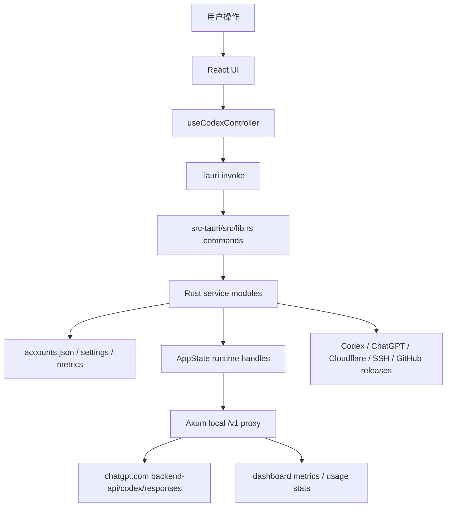

# 项目完整链路说明

本文档从运行入口到核心功能，把 Codex Tools 当前真实链路串起来。开发前先读本文件，再按 [项目开发规范（AI协作）.md](./项目开发规范（AI协作）.md) 执行。

## 1. 项目定位

Codex Tools 是一个基于 React + Tauri 的桌面控制器，核心目标是：

- 管理多个 Codex / ChatGPT 登录态账号。
- 查看账号 5h、1week、credits、Codex session token 用量。
- 一键切换本机 Codex 账号并启动 Codex / 同步 Opencode / 重启编辑器。
- 提供本地 OpenAI-compatible `/v1` API 反代，把下游请求转到 Codex 可用的 responses 链路。
- 通过 cloudflared 或远程 Linux proxyd 把本地代理暴露给 Cursor、CC Switch、ChatWise 等客户端。
- 提供 dashboard、托盘、自动更新、多语言和后台驻留能力。

## 2. 总体分层

关键事实：

- 前端不直接访问 Codex upstream；通过 Tauri command 或本地 proxy 走 Rust 层。
- 本地 proxy 不是独立 Web 后端，而是由桌面 app 或 proxyd 启动的 Axum 服务。
- 账号、设置、统计、运行态必须分清：持久化在文件中，运行态在 `AppState`，UI 状态在 React。

## 3. 应用启动链路

1. Vite/Tauri 加载 `src/main.tsx`，渲染 `src/App.tsx`。
2. `App.tsx` 调用 `useCodexController()` 获取账号、设置、代理、cloudflared、远程服务器、更新等状态和动作。
3. Tauri 主程序从 `src-tauri/src/main.rs` 进入 `app_lib::run()`。
4. `src-tauri/src/lib.rs` 初始化插件、日志、单实例、托盘、updater、`AppState`、Tauri command handler。
5. setup 阶段会同步开机启动设置、同步当前本机 Codex 登录账号、初始化系统托盘、启动 auth keepalive loop。
6. Tauri Ready 后，如果设置开启了 API proxy 自动启动，会调用 `auto_start_api_proxy_if_enabled()`。

涉及文件：`src/main.tsx`、`src/App.tsx`、`src/hooks/useCodexController.ts`、`src-tauri/src/main.rs`、`src-tauri/src/lib.rs`、`src-tauri/src/state.rs`、`src-tauri/src/settings_service.rs`、`src-tauri/src/store.rs`。

## 4. 账号导入与认证链路

### 4.1 导入当前本机账号

1. 前端触发 `onImportCurrentAuth()`。
2. `useCodexController.ts` 调用 Tauri command `import_current_auth_account`。
3. `lib.rs` 进入 `account_service::import_current_auth_account_internal()`。
4. 后端读取当前 `~/.codex/auth.json`，解析 ChatGPT/Codex token、account id、email、plan。
5. 账号写入应用数据目录中的 `accounts.json`。
6. 前端刷新账号列表和用量。

### 4.2 OAuth 导入账号

1. 前端打开添加账号弹窗，触发 `prepare_oauth_login`。
2. Rust 生成 OAuth URL、state、code verifier，并启动本地 callback listener。
3. 用户在浏览器授权后回跳 `http://localhost:<port>/auth/callback`。
4. listener 交换 token，导入账号，并向前端发 `oauth-callback-finished` 事件。
5. 前端关闭等待态并刷新账号列表。

### 4.3 批量导入 / 导出 / 删除 / 重命名 / 启停用

这些操作都走：

`React UI → useCodexController → Tauri command → account_service/store → accounts.json → 前端刷新`

开发时必须同步检查：账号列表、当前账号标记、profile integrity、auth refresh、导出 zip、启停用对 API proxy 候选池的影响。

涉及文件：`src/components/AddAccountDialog.tsx`、`src/components/AccountsGrid.tsx`、`src/hooks/useCodexController.ts`、`src-tauri/src/account_service.rs`、`src-tauri/src/auth.rs`、`src-tauri/src/store.rs`、`src-tauri/src/profile_files.rs`、`src-tauri/src/models.rs`。

## 5. 用量与 token 统计链路

### 5.1 账号用量

1. 前端周期或手动触发 `refresh_all_usage`。
2. Rust 从账号库取可刷新账号，必要时刷新 token。
3. `usage.rs` 调用 ChatGPT/Codex 用量接口，解析 5h、1week、credits；随后读取 `/backend-api/wham/rate-limit-reset-credits`，解析可用且未过期的 Codex 主动重置卡。
4. 如果用量接口只提示 access token expired，会显示“用量刷新登录令牌过期”的提示并允许后续刷新/切换重新校验；只有 refresh token 失效、账号停用或需要重新登录的错误才阻塞 keepalive 并提示重新授权。
5. reset credit 详细接口失败时，只在账号详情里显示局部失败，不影响 5h / 1week 用量展示。
6. 结果写回 `accounts.json` 并返回前端。
7. UI 在账号表格、右侧 inspector、摘要条、托盘和智能切换中使用；右侧账号详情额外展示可用重置卡数量、最近一张到期时间，并可展开全部可用重置卡到期时间。

### 5.2 Codex session token 用量

1. 前端触发 `get_codex_token_usage`。
2. `token_usage.rs` 扫描本机 Codex `sessions` 和 `archived_sessions` JSONL。
3. 汇总 24h、7d、30d、latest session token。
4. 前端 `MetaStrip` 展示。

涉及文件：`src-tauri/src/usage.rs`、`src-tauri/src/token_usage.rs`、`src-tauri/src/account_service.rs`、`src/components/MetaStrip.tsx`、`src/components/AccountsGrid.tsx`、`src/utils/usage.ts`、`src/utils/accountRanking.ts`。

## 6. 切换账号与启动 Codex 链路

1. 用户在账号卡点击切换，或触发智能切换。
2. 前端调用 `switch_account_and_launch`。
3. Rust 刷新目标账号 token，将目标账号写入当前 Codex auth/profile。
4. 根据设置决定是否启动 Codex app 或回退 `codex app`、同步 Opencode OpenAI auth、重启 Opencode Desktop、重启选择的编辑器。
5. 前端展示切换结果、错误或成功通知，并刷新账号状态。

涉及文件：`src/components/AccountsGrid.tsx`、`src/components/SettingsPanel.tsx`、`src/hooks/useCodexController.ts`、`src-tauri/src/lib.rs`、`src-tauri/src/auth.rs`、`src-tauri/src/opencode.rs`、`src-tauri/src/editor_apps.rs`、`src-tauri/src/cli.rs`。

## 7. API 反代链路

详细协议见 [docs/api-proxy.md](./docs/api-proxy.md)。这里给开发入口视角。

### 7.1 启动与状态

1. 用户在 `ApiProxyPanel` 设置端口、key、自动启动、负载策略等。
2. 前端调用 `start_api_proxy`。
3. Rust 读取 `AppSettings` 和账号库，启动 Axum 服务。
4. `AppState.api_proxy` 保存端口、api key、shutdown channel、task、runtime snapshot。
5. 前端通过 `get_api_proxy_status` 轮询状态。

### 7.2 请求转发

1. 下游客户端请求 `http://127.0.0.1:<port>/v1/*`。
2. Axum route 校验 API key。
3. 代理按 route 处理：
   - `/v1/models` 有可用账号时优先读取 Codex upstream catalog，并在 `models` 字段原样返回上游模型；读取失败才使用本地静态 fallback，`data` 字段保持 OpenAI-compatible model list。
   - `/v1/chat/completions` 归一化为 Codex responses payload。
   - `/v1/responses` 处理 OpenAI Responses 风格 payload。
   - `/v1/images/*` 把图片请求转成 responses image 工具输出，再转换回 images response。
   - `GET /v1/responses` 支持 WebSocket upgrade。
4. 候选账号按启用状态、指定 `ChatGPT-Account-Id`、用量、cooldown、顺序模式等过滤；runtime cooldown 只在仍有其他候选账号时降权失败账号，不能把唯一或全部剩余候选清空成误报 503。
5. 启动代理时解析 Codex CLI 客户端版本：优先 `CODEX_TOOLS_CODEX_CLIENT_VERSION`，其次本机 `codex --version` / `codex.cmd --version`，再读取全局 npm 包 `@openai/codex/package.json`，最后回退内置默认值；上游请求的 `Version`、`User-Agent` 和模型 catalog `client_version` 跟随该版本。
6. 上游请求带 Codex/ChatGPT access token 和账号 header。
7. 上游统一返回 SSE；下游流式请求会被持续转换回 OpenAI-compatible SSE，下游非流式 `/v1/chat/completions` 和 `/v1/responses` 会边读边解析 SSE，遇到 `response.completed` / `response.done` 终止事件后立即构造 JSON 返回，不等待上游连接自然结束。
8. 请求侧只保留必要兼容别名映射：旧客户端发送 `gpt-5-mini` 时转成上游支持的 `gpt-5.4-mini`；模型列表不再展示 `gpt-5-mini`，响应侧也不会把上游模型名改回兼容别名。
9. 对支持 Fast / Priority 服务档位的模型，如果下游没有传 `service_tier`，代理会在归一化后默认补 `service_tier: priority`；如果下游传 `service_tier: fast`，同样映射为上游的 `priority`。当前 `gpt-5.4-mini` 不标记 Fast / Priority，除非未来上游 catalog 明确声明。
10. `/v1/responses` 会兼容 OpenAI Responses 的字符串 `input` 写法，并剥离 Codex upstream 不接受的 `max_output_tokens` 字段。
11. 普通短聊天不会默认注入 `reasoning` / `reasoning.encrypted_content`；只有下游显式传 `reasoning_effort` 或 `reasoning` 时才补齐 reasoning 字段，避免无 reasoning 需求的请求被拖慢。
12. 代理默认启用 runtime-only session affinity：优先从下游显式 `Session_id` / `x-session-id` / `x-codex-session-id` header 提取会话 key，或从 Responses payload 的 `session_id` / `previous_response_id` / `conversation_id` / `user` 提取；key 只保存短 hash，不保存原始会话值。同一会话在账号仍可用时优先粘同一账号；无 key、无绑定、绑定账号已被用量/认证/cooldown 过滤时立即回退到现有选择策略。该映射只在运行态保存，有容量上限和过期淘汰，不写入账号库或设置。
13. 平均负载模式会在同优先级、同粗用量 bucket 账号内按上次命中账号轮转起点，并在 bucket 内账号都有最近延迟样本且差异足够明显时按 EWMA 优先低延迟账号；顺序模式才按 5h 阈值粘住当前账号。可用 session affinity 会在用量/认证/cooldown 过滤之后、sequential sticky 之前重排候选，不绕过账号可用性检查。
14. dashboard metrics、usage stats 和 trace 记录请求、失败、延迟、token、模型、账号和路由解释；流式 `/v1/chat/completions` 也会记录首块、SSE 进度和终止事件。这些文件写入在后台执行，不阻塞客户端响应返回。前端 Dashboard 的最近请求和最近失败会显示 status、错误类型、失败分类、完整错误正文，以及策略、候选数、选中账号脱敏标签、账号 ID hash 摘要、affinity/cooldown/latency 是否参与等 route explanation；Dashboard 支持按来源 endpoint、模型和脱敏账号筛选最近请求/失败，trace 日志只保留脱敏标签、hash 摘要和错误短摘要便于排查。

### 7.3 图片生成/编辑约束

所有 `gpt-image-2` / image2 / OpenAI Images API 调用，默认必须使用 Codex Tools 本地 proxy：

- Base URL：`http://127.0.0.1:<port>/v1`，默认端口 `8787`。
- 生成：`POST /images/generations`。
- 编辑：`POST /images/edits`。
- Model：`gpt-image-2`。
- API key：以 API 反代面板显示为准。

不要静默直连 `api.openai.com`。

涉及文件：`src/components/ApiProxyPanel.tsx`、`src/components/DashboardPanel.tsx`、`src/hooks/useCodexController.ts`、`src-tauri/src/proxy_service.rs`、`src-tauri/src/dashboard_metrics.rs`、`src-tauri/src/models.rs`、`docs/api-proxy.md`。

## 8. Dashboard 链路

1. API proxy 处理请求时写入 `dashboard_metrics`。
2. 指标落到内存 in-flight 与 `api-proxy-metrics.jsonl`。
3. 前端轮询 `get_api_proxy_dashboard` 和 `get_api_proxy_usage_stats`。
4. `DashboardPanel` 展示窗口统计、失败、延迟、模型、账号、endpoint、timeline，并在最近请求/最近失败日志中展开完整错误详情和路由解释；最近请求/失败可按来源 endpoint、模型和脱敏账号筛选。
5. 用户可以按 range / metric 切换，也可以清空 usage stats。

开发时要确认请求结束、失败、取消、流式和非流式都能正确释放 in-flight 状态。

## 9. cloudflared 公网访问链路

1. 前端检测 `get_cloudflared_status`。
2. 如未安装，调用 `install_cloudflared` 下载/安装。
3. 用户选择快速隧道或命名隧道。
4. `cloudflared_service.rs` 启动 cloudflared 子进程，记录 public URL、hostname、HTTP/2、日志和清理信息。
5. 前端轮询状态，可停止隧道。
6. 命名隧道涉及 Cloudflare API token、account id、zone id、DNS record 创建与清理。

涉及文件：`src/components/ApiProxyPanel.tsx`、`src/hooks/useCodexController.ts`、`src-tauri/src/cloudflared_service.rs`、`src-tauri/src/state.rs`、`src-tauri/src/models.rs`。

## 10. 远程 Linux proxyd 链路

1. 用户在 API 反代面板配置远程服务器。
2. 前端调用 `deploy_remote_proxy`。
3. `remote_service.rs` 解析本地 Rust toolchain，打包/生成远程构建源文件。
4. 通过 SSH / sshpass / identity file 上传、编译、部署 `codex-tools-proxyd`。
5. 远程 daemon 使用指定数据目录读取账号库并启动 `/v1` 代理。
6. 前端可刷新状态、启动、停止、读取日志。

涉及文件：`src-tauri/src/remote_service.rs`、`src-tauri/src/proxy_daemon.rs`、`src-tauri/src/bin/codex-tools-proxyd.rs`、`src-tauri/proxyd/src/main.rs`、`src-tauri/tauri.conf.json`、`docs/linux-proxyd.md`。

## 11. 设置链路

1. 前端设置项来自 `DEFAULT_SETTINGS` 和后端 `get_app_settings`。
2. 用户修改设置时，`useCodexController` 通过保存队列调用 `update_app_settings`。
3. Rust patch 更新 `AccountsStore.settings`。
4. 某些设置有立即副作用，例如开机启动、API proxy 端口/key、负载策略、编辑器重启目标、远程服务器列表。
5. 前端收到返回 settings 后刷新 UI。

新增设置必须同步：Rust 默认值、serde default、patch、归一化、前端类型、前端默认值、UI、文档和测试。

## 12. 更新、托盘与后台驻留链路

- `tauri-plugin-updater` 使用 `src-tauri/tauri.conf.json` 中的 GitHub release endpoint。
- 前端通过 `checkForAppUpdate`、`installPendingUpdate`、`UpdateBanner` 展示和安装更新。
- 关闭窗口时按配置后台驻留，托盘由 `tray.rs` 管理。
- 托盘展示与账号用量、当前账号、窗口恢复相关。

涉及文件：`src/components/UpdateBanner.tsx`、`src-tauri/src/lib.rs`、`src-tauri/src/tray.rs`、`src-tauri/tauri.conf.json`。

## 13. 多语言链路

1. `src/i18n/I18nProvider.tsx` 管理 locale。
2. `src/i18n/catalog.ts` 定义支持语言。
3. `src/i18n/locales/*.json` 存放前端文案。
4. `src/i18n/backendErrors.ts` 对后端错误做前端本地化补充。
5. Rust `i18n.rs` 用于后端错误与提示辅助。

新增 UI 文案不能只加一个语言；至少确认 fallback 行为和中文无乱码。

## 14. 发布链路

1. 版本字段需要同步：`package.json`、`src-tauri/Cargo.toml`、`src-tauri/proxyd/Cargo.toml`、`src-tauri/tauri.conf.json`，以及必要的 `changelog.md` / `README.md` / 应用截图。
2. GitHub Actions `release.yml` 在 tag `v*` 或手动触发时构建发布。
3. 当前远端 workflow 的 release body 仍是静态模板；如果要启用“从 `changelog.md` 抽取当前 tag 对应版本段作为 GitHub Release notes”，必须先用带 `workflow` scope 的 token 成功推送 workflow 变更。
4. 构建矩阵包含 macOS Apple Silicon、macOS Intel、Windows。
5. updater artifact 由 Tauri action 生成，签名依赖 GitHub secrets。
6. fork 发布和上游 PR 要分开处理：fork 的主线是 `fork/main`、Release 发布在 `mingisrookie/codex-tools`；上游 PR 才以 `origin/main` / `170-carry/codex-tools` 为目标。

## 15. 开发改动时的链路检查法

- 改 UI：查组件、hook、类型、i18n、样式、后端 command 是否匹配。
- 改账号：查 account_service、auth、store、profile、usage、switch、export/import、API proxy 候选池。
- 改设置：查 models 默认值、settings_service、前端 DEFAULT_SETTINGS、SettingsPanel、保存恢复。
- 改 API proxy：查 route、payload、账号候选、SSE/WebSocket、dashboard、usage、docs/api-proxy。
- 改 cloudflared：查本机安装、进程句柄、停止清理、命名隧道 API、UI 状态。
- 改远程 proxyd：查 remote_service、proxy_daemon、proxyd crate、打包资源、docs/linux-proxyd。
- 改发布：查 package/Cargo/Tauri/proxyd 版本、release workflow、updater、changelog、README 和公开截图是否同步。
- 改文档：查相对链接、乱码、是否与真实源码一致。

<!-- DXM-TRELLIS:START -->

## DXM 大开发工作流链路

中大型开发、新模块、跨多文件重构、需求不清楚的任务，默认走：

1. 默认用 `grill-with-docs` 把需求问清楚；只有用户明确要求或完全缺少项目/文档上下文时，才退到 `grill-me`。
2. 提问时先从代码和文档自行判断，能确定的是否题、偏好题、低风险取舍题直接作为推荐假设推进；只把真正阻塞、高影响、无法推断的问题成组交给用户拍板。
3. 把结论写入 `.trellis/tasks/<task>/prd.md`，不能只停留在聊天上下文里。
4. 用 `.trellis/scripts/task.py start <task>` 进入 Trellis active task。
5. 按 Trellis 的 implement/check/update-spec/finish 节奏开发、验证、沉淀规范。
6. 任务完成后同步 DXM 长期文档；不能只更新 `.trellis/` 内部状态。

<!-- DXM-TRELLIS:END -->
